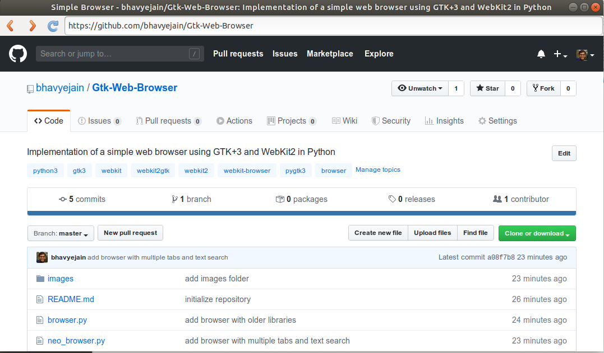

# GTK WEB BROWSER

This repository contains 3 browser implementations.
The web browsers are created using the GTK+3 GUI toolkit and WebKit2 web engine.

## Browser
```browser.py``` is a single tab browser made by following some online tutorials.
It uses outdated versions of the WebKit engine. This version of WebKit works for Ubuntu 16.04 and older.
An installation of the older version of WebKit might be required to make this work.

## Simple Browser
```simple_browser.py``` is a single tab browser that utilizes the latest versions of GTK and WebKit2.
This was made by primarily modifying ```browser.py``` to incorporate the latest code.


## Neo Browser
```neo_browser.py``` is a more complete browser.
This browser supports multiple tabs (create, switch, close) and text searching in a tab.
This implementation also uses the latest versions of GTK+3 and WebKit2.
"